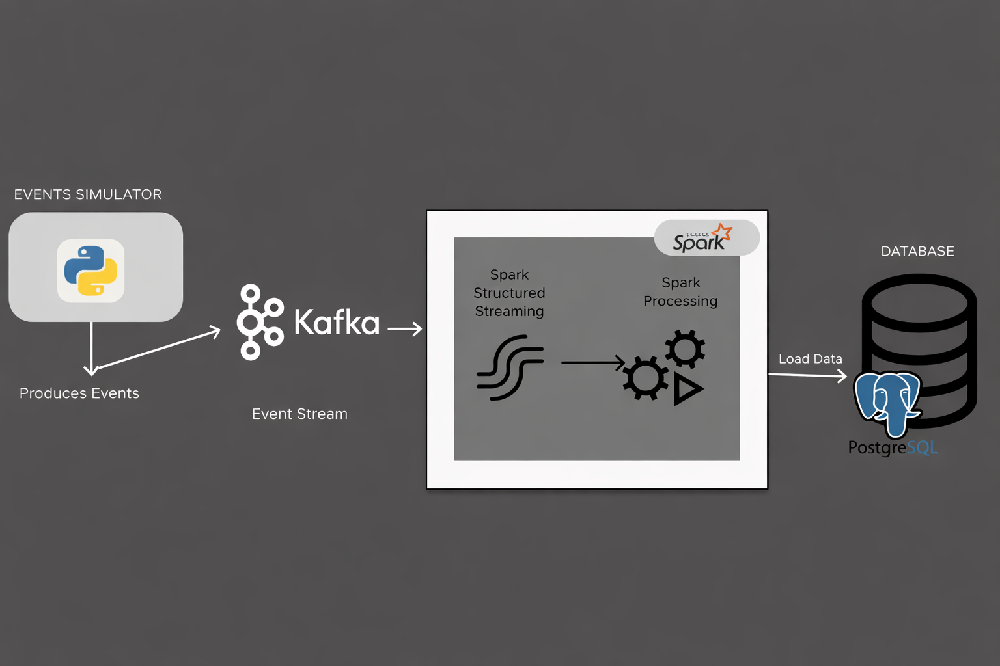

# Project Overview

## Real-Time Data Ingestion Using Spark Structured Streaming & PostgreSQL

This project presents a real-time data pipeline that simulates an e-commerce platform's activity tracking system. The pipeline encompasses generating synthetic user events, processing real-time data streams through Apache Spark Structured Streaming, and storing processed information in a PostgreSQL database.

### Project Objective
- Simulate and Ingest Streaming Data
- Use Spark Structured Streaming To Process Data in Real Time
- Store and Verify Processed Data in A PostgreSQL Database
- Understand the Architecture of A Real-time Data Pipeline
- Measure and Evaluate System Performance

### Tools & Technologies 
- Apache Spark Structured Streaming
- PostgreSQL
- Python (for data generation)
- SQL (for database setup)
- Apache Kafka (event streaming platform)
- Prometheus & Grafana (for monitoring)

## Project Folder Structure
```
real-time-data-ingestion/
│
├── docker-compose.yml         # Your docker-compose file (containers: postgres, spark-master, spark-worker)
│
├── spark/
│   ├── apps/
│   └─── resources/
│       └── postgresql-42.7.2.jar # PostgreSQL JDBC driver
│
├── e-commerce-user-events/             # The folder where synthetic user events are saved
│   |── product-purchase-events/        # 
|   └── product-view-events/
│
|
├──scripts/
|   ├── python/                    # script generating the dummy ecommerce product evnnts by users
|   └─── sql/                     # sql script to create database and table
├── docs/                      # Setup instructions
└── .env                         # Environment variables like POSTGRES_PASSWORD
```


### Project Architecture


#### In the case of using Kafka as the event stream


- **Data Ingestion Simulation**  
  The system uses the **Factory Design Pattern** to modularly and extensibly manage event generators. Each event generator can now either:
    - Write directly to a CSV file, or
    - Publish events to a Kafka topic for real-time streaming.

  #### Event Generation and Export
    On each run:
    - The system generates 25–50 random events of each type.
    If writing to CSV:
        - Creates a new `.csv` file in the appropriate subdirectory:
        - `product-view-events/`
        - `product-purchase-events/`
    - File names are suffixed with a UUID, e.g.:
        - `product_view_events_18e07c3a.csv`
        - `product_purchase_event_a8b83b92.csv`
    - If publishing to Kafka: sends events to the configured Kafka topic.


- **Streaming Data Using Spark Structured Streaming**  
 - Spark monitors the directories where CSVs are generated and processes new files
  `OR`
  Spark monitors Kafka topics for new events.
  - Data is transformed (e.g., combining date columns, deduplication, casting types).
  - Transformed events are written to PostgreSQL using Spark’s JDBC connector.

- **Load Data in PostgreSQL Database**  
  - Transformed streaming data is loaded into a PostgreSQL event log table.
  - Supports UPSERT logic to prevent duplicate entries while maintaining consistency.

- **Monitoring and Metrics**
  - Spark streaming performance metrics (e.g., batch processing time, input/output rate, state store size) are exposed to Prometheus.
  - Grafana dashboards visualize Spark performance in real time, allowing proactive monitoring and optimization.
