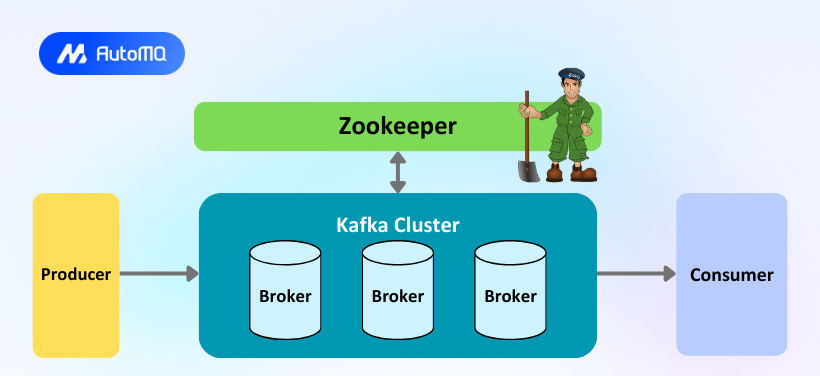

# Event-Driven Systems with Apache Kafka  
### Technical Lecture (Data Engineering Focus)

This lecture introduces **event-driven architecture** with a deep focus on **Apache Kafka** as a distributed event streaming platform.  
It is designed for **data engineers** working with distributed systems, streaming pipelines, and modern data platforms.

---

## Learning Objectives

By the end of this lecture, participants should be able to:

- Understand event-driven systems and their advantages over monoliths
- Explain the importance of decoupling in distributed data systems
- Differentiate messaging systems from event streaming platforms
- Understand Kafka’s architecture and internal components
- Explain Kafka as a distributed system (brokers, partitions, replication)
- Understand Kafka metadata management (ZooKeeper vs KRaft)
- Write and reason about simple Kafka producers and consumers
- Identify real-world Kafka use cases in data engineering

---

## 1. Event-Driven Systems Overview

An **event-driven system** is an architectural style where components communicate by producing and consuming **events**.

An **event** is a fact that something has already happened:
- `OrderPlaced`
- `PaymentConfirmed`
- `UserRegistered`
- `CDC_Record_Inserted`

### Key Properties
- Asynchronous communication
- Loose coupling
- High scalability

---

## 2. Monolithic vs Event-Driven Architecture

### Monolithic Architecture
- Tight coupling
- Cascading failures
- Limited scalability
- Difficult deployments

### Event-Driven Architecture
- Services communicate via events
- Independent scaling and deployment
- Fault isolation

**Diagram: Monolithic vs Event-Driven**

---

## 3. Decoupling in Event-Driven Systems

Event-driven systems provide decoupling across three dimensions:

### 1. Temporal Decoupling
- Producers do not wait for consumers
- Consumers can process events later

### 2. Structural Decoupling
- No direct service-to-service calls
- No shared runtime dependencies

### 3. Deployment Decoupling
- Independent deployments
- New consumers added without modifying producers

> Decoupling is foundational to scalable distributed data platforms.

---

## 4. Messaging Systems vs Event Streaming

### Messaging Systems (RabbitMQ, AWS SQS)
- Queue-based
- Messages removed after consumption
- Best for task execution and commands

### Event Streaming Platforms (Kafka)
- Append-only distributed log
- Events retained for replay
- Multiple independent consumers
- Optimized for throughput and durability

| Feature | Messaging | Kafka |
|------|---------|-------|
| Retention | Short-lived | Time/size-based |
| Replay | No | Yes |
| Consumption | Competing | Independent |
| Ordering | Limited | Per partition |

---

## 5. Kafka High-Level Architecture

### Core Kafka Components
- **Producer** – publishes events
- **Broker** – Kafka server
- **Topic** – logical event stream
- **Partition** – ordered subset of a topic
- **Consumer** – reads events
- **Consumer Group** – enables parallel consumption

**Diagram: Kafka Producer → Brokers → Consumers**

---

## 6. Kafka as a Distributed System

### Brokers
- A broker is a Kafka server
- A Kafka cluster consists of multiple brokers
- Brokers store data and serve producers and consumers

### Broker Communication
- Leader–Follower replication model
- Leaders handle reads/writes
- Followers replicate data

**Diagram: Kafka Brokers Communication**

---

## 7. Topics and Partitions

### Topics
- Logical streams of events
- Examples:
  - `orders`
  - `payments`
  - `user_events`
  - `cdc_mysql_orders`

### Partitions
- Topics are divided into partitions
- Each partition is:
  - Ordered
  - Immutable
  - Append-only

Why partitions matter:
- Parallelism
- Scalability
- Fault tolerance

> Ordering is guaranteed **per partition**, not per topic.

---

## 8. Replication and Fault Tolerance

- Each partition has one **leader** and multiple **replicas**
- Followers replicate data from the leader
- If a leader fails, a follower is elected automatically

This ensures:
- High availability
- Data durability
- Minimal downtime

---

## 9. Kafka Metadata Management: ZooKeeper vs KRaft

### ZooKeeper-Based Kafka (Legacy)
Kafka relied on ZooKeeper for:
- Cluster coordination
- Metadata storage
- Leader election

Challenges:
- Operational complexity
- Additional dependency
- Scaling limitations

### KRaft (Kafka Raft Metadata Mode)
- Kafka manages metadata internally
- Uses Raft consensus protocol
- No ZooKeeper dependency
- Simplified operations
- Better scalability

**Diagram: ZooKeeper vs KRaft Architecture**

---
# Kafka Connect  
### Data Integration Framework for Apache Kafka

Kafka Connect is a framework for **reliably moving data into and out of Kafka**.  
It eliminates the need to write custom producers and consumers by providing **pre-built, scalable, and fault-tolerant connectors**.

## 10. Kafka in Data Engineering Pipelines

### Common Use Cases
- Change Data Capture (Debezium → Kafka)
- Real-time ingestion pipelines
- Stream processing (Spark, Flink)
- Data lake ingestion
- Metrics and log aggregation
- Event-driven microservices

